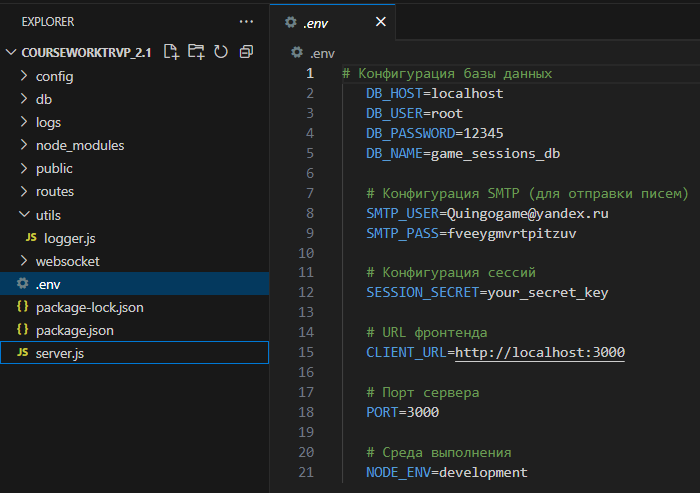
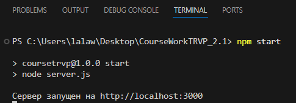
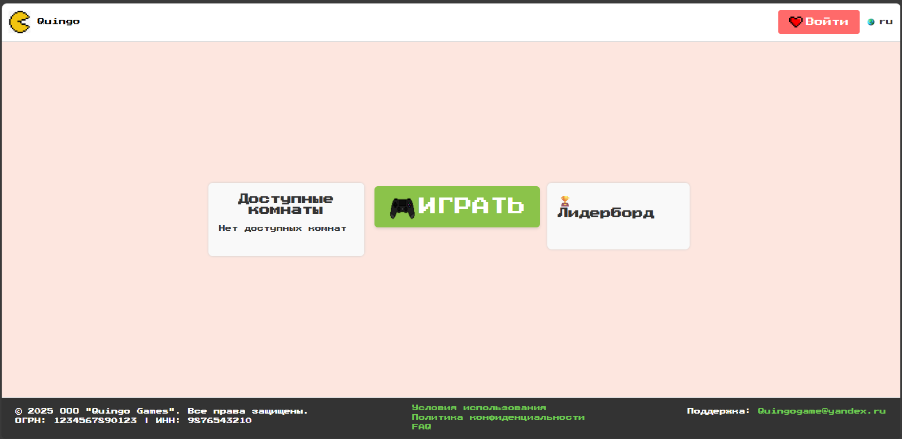

# Site_quiz_Quingo

# Инструкция по запуску приложения

## Шаг 1: Запуск базы данных

1. Откройте **MySQL Workbench 8.0**.
2. Перейдите в папку `Project Database` и скачайте `CreateDB.sql`.
3. Запустите SQL-скрипт `CreateDB.sql` в **MySQL Workbench 8.0**, чтобы создать базу данных и все необходимые таблицы.

## Шаг 2: Настройка проекта

1. Скачайте проект **CourseWorkTRVP_2.1**.
2. Откройте проект в **Visual Studio Code**.
3. Перейдите к файлу `.env` и откройте его.  
   Измените конфигурацию подключения к базе данных на ваши собственные значения.

   

## Шаг 3: Запуск сервера

1. Откройте терминал в корне проекта.
2. Введите одну из следующих команд:

   ```bash
   npm start
   ```

   или

   ```bash
   node server.js
   ```

   

## Шаг 4: Открытие веб-приложения

1. Перейдите по адресу [http://localhost:3000](http://localhost:3000) в вашем браузере.
2. Откроется главная страница приложения.

   
